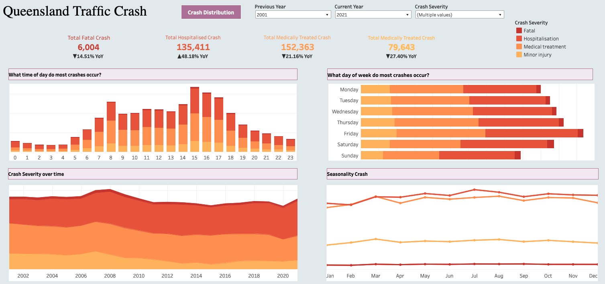
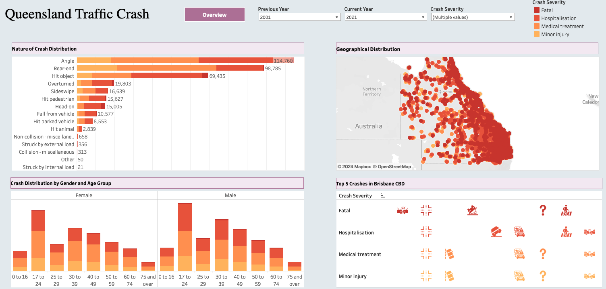

# Queensland Traffic Crash Analysis

## Overview
This project offers data-driven insights into crashes in Queensland. By analyzing this data, the State can gain a deeper understanding of local incidents and enhance its ability to meet citizen expectations. The dataset is collected from Kaggle.com including the historical data from all reported Queensland road crashes between 2001 and 2021.

Link to **[interactive report](https://public.tableau.com/views/crash_queensland/Overview?:language=en-GB&publish=yes&:sid=&:redirect=auth&:display_count=n&:origin=viz_share_link)**

## Project Goals
- What are the outcomes of incidents (Fatal, Hospitalisation, Medical Treatment, Minor Injury)?
- What time of day do most incidents occur?
- What day of week do most incidents occur?
- What is the trend of crash severity over time?
- Is there a seasonal pattern for incidents?
- How does the nature of crash affect the number of incidents?
- Which location do most incidents occur?
- What is the relationship between age and gender affecting the proportion of incidents?
- What are the top incidents in Brisbane CBD?

## Dashboard Overview
The Queensland Traffic Crash Report provide a user-friendly interface and offer the following views:

### Overview
- From 2001 to 2021, the number of crashes in Fatal, Medical Treatment, Minor Injury showed the downward trend. However, the total Hospitalised crashes significantly increased with 48.18%.
- The number of incidents on weekdays are much greater than that on weekends with the top peak on Friday.
- July had the most incidents compared to other months. The number of Fatal and Minor Injury crashes was stable during months while Hospitalised and Medical Treatment crashes slightly increased.
- Early morning rush hours (7am - 9am) and afternoon rush (2pm - 5pm) are the time periods most incidents occur.
- The total number of incidents increased from 2001 to 2008 with the highest incidents in 2008 and dramatically decreased until 2020. However, the slight increase was observed in 2021, serving as a warning to the government.

### Crash Distribution
- Angle, Rear-end, Hit object are the top nature of crashes from 2001 to 2021.
- Younger women and men (17 to 24) involved in proportionately more incidents. Elderly 75 years old and over was the least group having accidents compared to other groups.
- There were the significant number of incidents occurred in main roads, Brisbane CBD and surrounding suburbs.
- Intersection from adjacent approaches was observed from all crash severities in Brisbane CBD.

